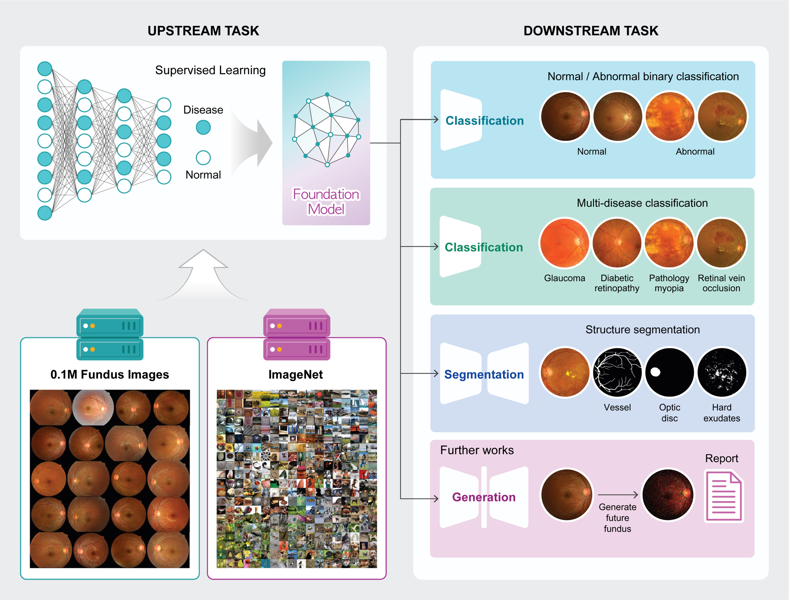

## "A Disease-Specific Foundation Model Using Over 100K Fundus Images: Release and Validation for Abnormality and Multi-Disease Classification on Downstream Tasks"




Please contact  **balinda@snu.ac.kr** or **boajang97@gmail.com** if you have any questions.

Main repository: https://github.com/Jang-Boa/Research-Foundation-Retina

_*The repository is currently empty. All codes will be uploaded after publication.* All the update of this repository will be shown up in [Main repository](https://github.com/Jang-Boa/Research-Foundation-Retina) first.

### Key Features 
- Fundus and ImageNet+Fundus is pre-trained on 0.1 million retinal images with super-vised learning.
- Fundus and ImageNet+Fundus can be efficiently adapted to customised tasks.


### Fine-tuning with Fundus and ImageNet+Fundus weights
- "The current maintenance and GitHub update are scheduled. The model will be released after the paper is published."

### 📃Citation

If you find this repository useful, please consider citing this paper:
```

```

### License
Code and Model Weights are only can used for Research.
